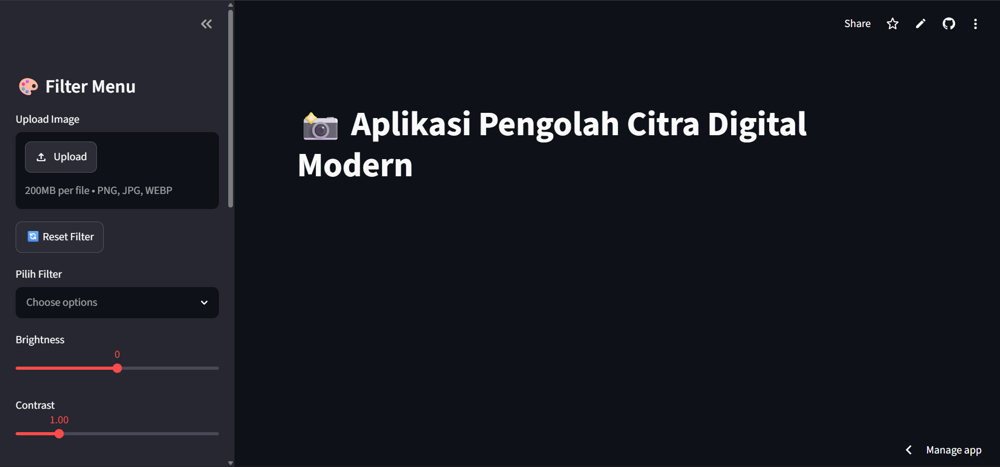
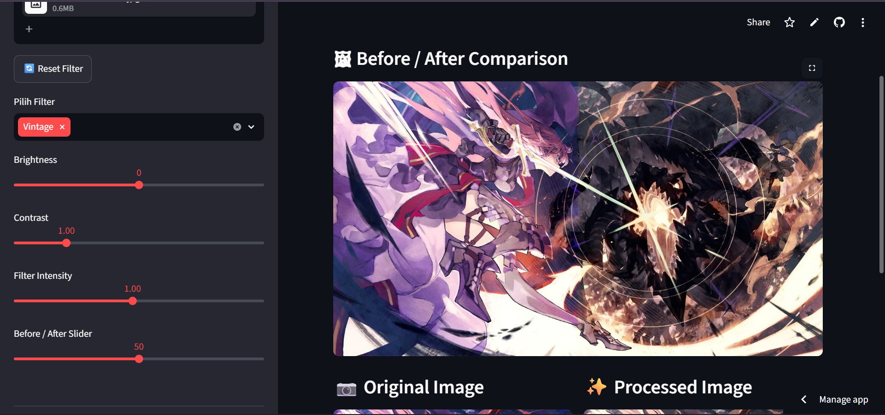
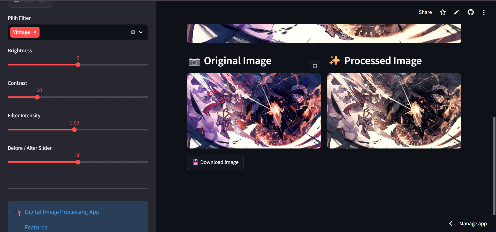
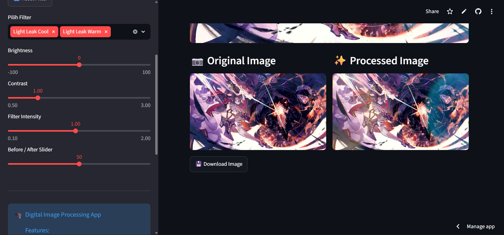
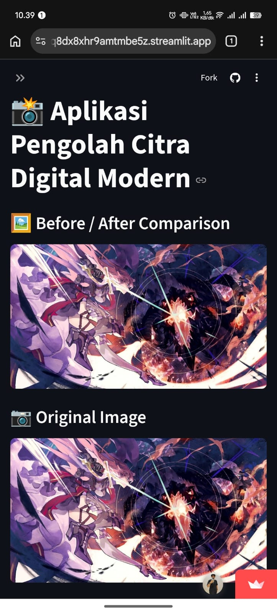
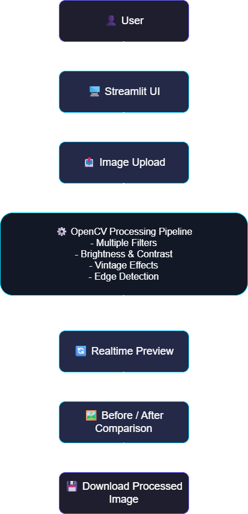
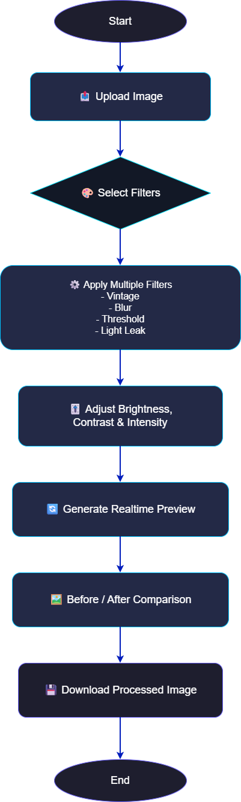

# 📸 Digital Image Processing App

Modern web-based image processing application built using Streamlit and OpenCV with realtime preview, multiple filter stacking, before/after comparison, and mobile-friendly deployment.

This project was developed as a group assignment for the Digital Image Processing course at Universitas Putera Batam.

---

# 🌐 Live Demo

### Streamlit Cloud Deployment
🔗 https://modern-image-processing-app-jlnlsq8dx8xhr9amtmbe5z.streamlit.app/

### GitHub Repository
🔗 https://github.com/Rell160/modern-image-processing-app

---

# 🖼️ Main Interface



---

# ✨ Features

- Multiple Filter Stacking
- Realtime Image Preview
- Before / After Comparison Slider
- Vintage Effects
- Old Photo Effects
- Light Leak Effects
- Scratches Effects
- Threshold Processing
- Gaussian Blur
- Canny Edge Detection
- Rotate 90°
- Flip Horizontal
- Flip Vertical
- Brightness Adjustment
- Contrast Adjustment
- Filter Intensity Control
- Download Processed Image
- Mobile Responsive UI
- Cloud Deployment with Streamlit Cloud

---

# 🧠 Technologies Used

- Python
- Streamlit
- OpenCV
- NumPy
- Pillow

---

# 📷 Screenshots

## Before / After Comparison



---

## Multiple Filter Stacking


---

## Vintage Filter Example



---

## Light Leak Effect



---

## Download Processed Image

.png)
.png)

---

# 📱 Mobile Responsive View

The application is fully accessible through mobile devices using Streamlit Cloud deployment.



---

# 🏗️ Architecture Diagram



---

# 🔄 Processing Flowchart



---

# ⚙️ How It Works

1. User uploads an image
2. Image is processed using OpenCV
3. Selected filters are applied sequentially
4. User adjusts brightness, contrast, and intensity
5. Realtime preview is generated
6. Before / after comparison is displayed
7. User downloads the processed image

---

# 🚀 Installation

Clone the repository:

```bash
git clone https://github.com/Rell160/modern-image-processing-app.git